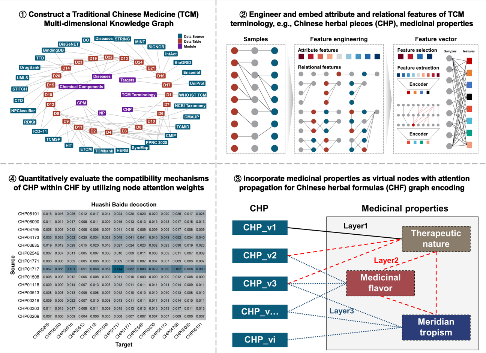

# GraphAI-for-TCM

**Author**: Zeng Jingqi  
**Contact**: [zjingqi@163.com](mailto:zjingqi@163.com)  
**Project update**: April 2026

---

## Overview

**GraphAI-for-TCM** is a graph artificial intelligence framework for studying compatibility mechanisms in Traditional Chinese Medicine (TCM) formulae. The repository is designed as the model and workflow companion to the **Traditional Chinese Medicine Multidimensional Knowledge Graph (TCM-MKG)** resource and supports graph construction, model inference, mechanism interpretation, and reproducible training experiments.

This project is associated with the following article:

Zeng, J., & Jia, X. (2025). *Quantifying compatibility mechanisms in traditional Chinese medicine with interpretable graph neural networks*. **Journal of Pharmaceutical Analysis, 15**(8), 101342.  
Paper: [https://doi.org/10.1016/j.jpha.2025.101342](https://doi.org/10.1016/j.jpha.2025.101342)

The underlying multidimensional knowledge resource is available as:

Zeng, J., & Jia, X. (2024). *Traditional Chinese Medicine Multidimensional Knowledge Graph (TCM-MKG) (V1.0)* [Data set]. China Pharmaceutical University.  
Dataset: [https://doi.org/10.5281/zenodo.13763953](https://doi.org/10.5281/zenodo.13763953)

Based on the published study and dataset record, the framework integrates standardized TCM terminology, Chinese patent medicines, Chinese herbal pieces, pharmacognostic origins, chemical compounds, biological targets, and diseases into a unified analytical pipeline. In the paper, graph neural networks with attention mechanisms are used to represent Chinese herbal formulae and to quantify herb-herb compatibility patterns in an interpretable way.

---

## Scientific Scope

This repository focuses on three connected tasks:

1. **Knowledge-guided representation of TCM formulae**  
   Formulae are encoded as graph-structured or hypergraph-structured samples built from Chinese herbal pieces and their medicinal-property semantics.

2. **Interpretable graph learning for compatibility analysis**  
   Attention-based graph models are used to capture interactions among herbal components, with medicinal properties such as therapeutic nature, flavor, and meridian tropism incorporated as structured prior knowledge.

3. **Quantitative mechanism interpretation**  
   The workflow exposes attention-derived outputs that support downstream interpretation of compatibility strength, herb pair relationships, and formula-level mechanistic patterns.

The associated publication reports that the broader TCM-MKG-driven framework was built from seven standardized modules and used to analyze 6,080 Chinese herbal formulae. It also describes a neighbor-diffusion strategy for improving compound-target coverage in the knowledge graph, providing the biomedical context that supports the downstream graph learning workflow in this repository.

---

## Repository Structure

- **Data**  
  Core input data, reproducibility assets, and generated outputs used by the notebooks and pretrained model.
  - `CHP_Encoder.tsv`: encoded descriptors for Chinese herbal pieces
  - `CHP_Medicinal_properties.tsv`: medicinal-property annotations used in graph encoding
  - `Chinese_herbal_pieces.tsv`: reference table for CHP identifiers and herb names
  - `Test_input.xlsx`: example input for prediction workflows
  - `all_graphs_with_labels-train.pt`: training set for graph-based experiments
  - `all_hypergraphs_with_labels-train.pkl`: training set for hypergraph-based experiments
  - `prediction_outputs.tsv`, `attention_weights.tsv`, `attention_averages.tsv`, `calculated_attention_weights.tsv`: example result and interpretation outputs

- **Model**  
  Contains the pretrained graph attention model `gat_model.pth` for compatibility prediction and interpretation workflows.

- **Python**  
  Jupyter notebooks covering graph construction, model prediction, interpretability analysis, and alternative graph-learning settings:
  - `1_Graph Embedding in TCM Formulas.ipynb`
  - `2_Prediction Using the GAT Model.ipynb`
  - `3_Quantitative Evaluation of Compatibility Mechanisms Using the GAT Model.ipynb`
  - `Graph Attention Network.ipynb`
  - `Graph Transformer Network.ipynb`
  - `Hypergraph Neural Network.ipynb`
  - `Transforming Graph Encoding to Hypergraph Encoding.ipynb`

---

## Data Availability and Reproducibility

This repository now includes the two training assets that were previously absent from the public project snapshot:

- `Data/all_graphs_with_labels-train.pt`
- `Data/all_hypergraphs_with_labels-train.pkl`

Their inclusion improves reproducibility for users who want to inspect or extend the training workflow rather than only run pretrained inference. The broader biomedical knowledge resource used to support this work remains available through the public TCM-MKG Zenodo record linked above.

---

## Recommended Environment

- Python 3.10+
- PyTorch 2.7.1
- Torch Geometric 2.6.1
- scikit-learn 1.7.0
- NumPy 2.3.0
- pandas 2.3.0
- SciPy 1.15.3
- matplotlib 3.10.3
- tqdm 4.67.1

CPU execution has been tested for the current workflow; a compatible GPU-enabled PyTorch environment can also be used.

---

## Citation

If you use this repository, please cite the article and dataset:

1. Zeng, J., & Jia, X. (2025). *Quantifying compatibility mechanisms in traditional Chinese medicine with interpretable graph neural networks*. **Journal of Pharmaceutical Analysis, 15**(8), 101342. [https://doi.org/10.1016/j.jpha.2025.101342](https://doi.org/10.1016/j.jpha.2025.101342)
2. Zeng, J., & Jia, X. (2024). *Traditional Chinese Medicine Multidimensional Knowledge Graph (TCM-MKG) (V1.0)* [Data set]. China Pharmaceutical University. [https://doi.org/10.5281/zenodo.13763953](https://doi.org/10.5281/zenodo.13763953)

---

## Contact

For questions regarding the repository, data organization, or model workflow:

**Zeng Jingqi**  
Email: [zjingqi@163.com](mailto:zjingqi@163.com)

---
