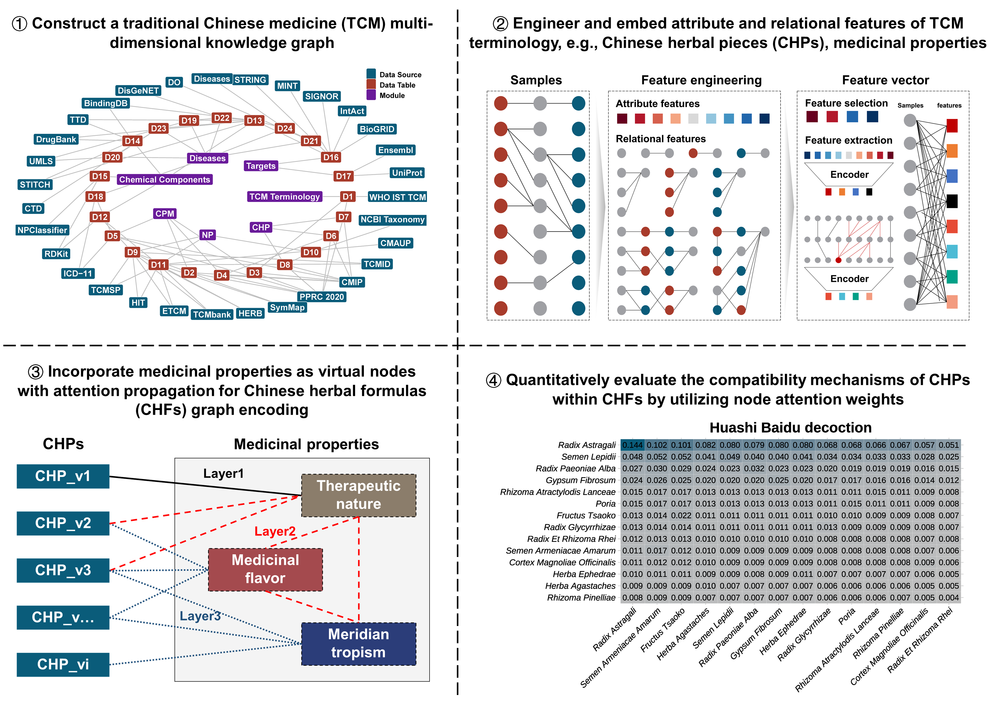

# **GraphAI-for-TCM**

**Author**: Zeng Jingqi  
**Contact**: [zjingqi@163.com](mailto:zjingqi@163.com)  
**Date**: November 10, 2024  

---

## **Overview**

**GraphAI-for-TCM** complements the **Traditional Chinese Medicine Multi-dimensional Knowledge Graph (TCM-MKG)** project, forming a cohesive system designed to facilitate the quantitative evaluation of compatibility mechanisms within Traditional Chinese Medicine (TCM). The code and models provided here are part of my study titled:

> **"Graph Neural Networks for Quantifying Compatibility Mechanisms in Traditional Chinese Medicine"**

**Zeng, J., & Jia, X. (2025). Quantifying compatibility mechanisms in traditional Chinese medicine with interpretable graph neural networks. Journal of Pharmaceutical Analysis, 101342.**  
Available at: [https://doi.org/10.1016/j.jpha.2025.101342)

In this study, graph-based artificial intelligence techniques are employed, focusing specifically on graph attention mechanisms to analyze and interpret the intricate compatibility relationships within TCM formulations. This repository includes pre-trained models, data processing scripts, and example workflows, empowering users to conduct advanced TCM compatibility studies.

### Research Framework for Analyzing Compatibility Mechanisms in TCM Using Graph Neural Networks

The figure below illustrates the research framework using Graph Neural Networks (GNNs) to explore compatibility mechanisms in Traditional Chinese Medicine (TCM). The workflow includes four primary components:

1. **Construction of a Multi-dimensional Knowledge Graph for TCM**  
   The process begins by constructing a comprehensive knowledge graph integrating data from multiple sources (e.g., TCMSP, HERB, BindingDB), capturing various dimensions of TCM, such as diseases, targets, chemical components, and terminologies. This graph serves as the structured foundation for applying GNNs.

2. **Feature Engineering and Embedding for TCM Terminology**  
   Feature engineering is conducted to extract and embed both attribute and relational features of Chinese herbal pieces (CHP). Attributes include therapeutic properties, medicinal flavor, and meridian tropism, while relational features capture compatibility relationships between herbs. This process generates feature vectors for model input.

3. **Incorporation of Medicinal Properties as Virtual Nodes for TCM Graph Encoding**  
   To better capture TCM formula characteristics, medicinal properties (e.g., therapeutic nature, medicinal flavor, meridian tropism) are modeled as virtual nodes. A multi-layer attention propagation mechanism enables the GNN to model complex relationships among herbs, creating a robust graph representation for TCM formulations.

4. **Quantitative Evaluation of Herb Compatibility via Node Attention Weights**  
   Node attention weights are utilized to quantitatively assess compatibility among herbs within TCM formulas. The matrix shown in the figure below displays attention weights for herb compatibility in the "Huashi Baidu Decoction," allowing identification of strong herb pairs and insights into formulaic principles.

---

## **Repository Structure**

- **Data**: Contains essential datasets needed for model operation, including:
  - **CHP_Encoder** and **CHP_Medicinal_properties**: Encoded information about TCM components, supporting model analysis capabilities.
  - **Test_input**: Example input file where users can substitute their own data for predictions.
  - **Intermediate files**: Files generated during model operation, such as `prediction_outputs` and `attention_weights`, capturing model outputs and attention metrics for interpretation.

- **Model**: Houses the pretrained Graph Attention Network model, `gat_model.pth`, optimized for TCM compatibility analysis. This model leverages attention mechanisms to assess and quantify compatibility, providing options for direct predictions and further fine-tuning.

- **Python**: Includes several Jupyter notebooks essential for performing compatibility analysis:
  - **1_Graph Embedding in TCM Formulas.ipynb**: Prepares TCM formulations as graph structures for analysis.
  - **2_Prediction Using the GAT Model.ipynb**: Uses the pretrained GAT model to perform compatibility predictions.
  - **3_Quantitative Evaluation of Compatibility Mechanisms Using the GAT Model.ipynb**: Conducts quantitative evaluation of the model's predictions, providing insights into TCM compatibility mechanisms.

  Additional notebooks explore alternative models, such as Graph Transformer Networks and Hypergraph Neural Networks, offering insights into various graph-based approaches for TCM data analysis.

---

## **Citation**

Zeng, J., & Jia, X. (2025). Quantifying compatibility mechanisms in traditional Chinese medicine with interpretable graph neural networks. Journal of Pharmaceutical Analysis, 101342. https://doi.org/10.1016/j.jpha.2025.101342

---

## **Contact**  

For questions or further information, please feel free to reach out:

**Zeng Jingqi**  
Email: [zjingqi@163.com](mailto:zjingqi@163.com)

---
